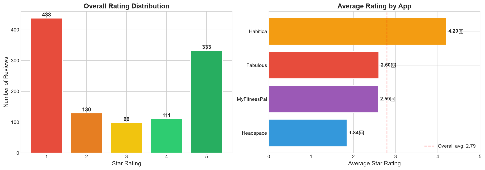
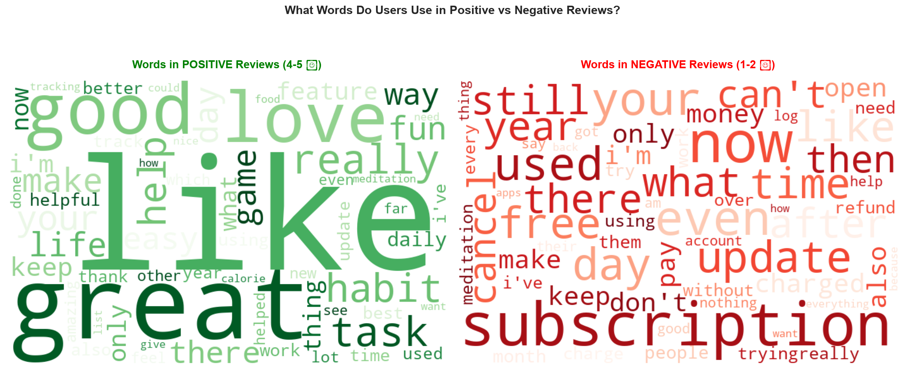
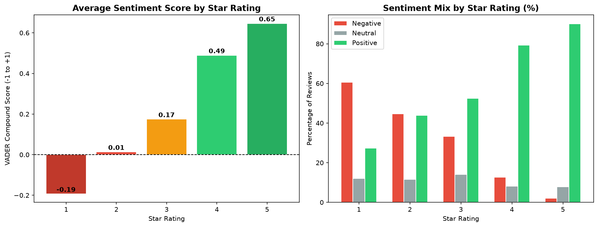
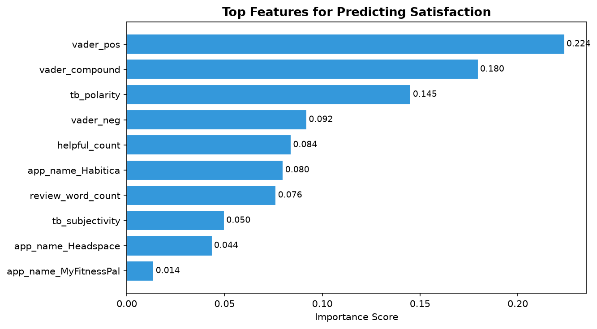

# Wellness App Sentiment & Retention Analysis

## Overview
This project analyzes 1,111 real user reviews from 4 major 
wellness apps on the Google Play Store to understand what 
drives user satisfaction — using NLP sentiment analysis 
and machine learning.

**Apps Analyzed:** Habitica, Headspace, MyFitnessPal, Fabulous

---

## The Business Question
> "What do user reviews reveal about satisfaction drivers 
> in wellness apps — and can we predict user sentiment 
> automatically?"

This matters because:
- Product teams spend hours manually reading reviews
- Negative reviews contain early warning signals
- Understanding WHY users are unhappy helps prioritize fixes

---

## Tools Used
| Tool | Purpose |
|------|---------|
| google-play-scraper | Collect real reviews |
| pandas | Data cleaning and analysis |
| matplotlib / seaborn | Visualizations |
| TextBlob | Sentiment analysis |
| VADER | Sentiment analysis |
| scikit-learn | Machine learning models |

---

## Project Structure
```
wellness_project/
├── data/
│   ├── raw_reviews.csv          
│   ├── clean_reviews.csv        
│   └── sentiment_reviews.csv   
├── notebooks/
│   ├── 01_scraping.ipynb        
│   ├── 02_cleaning.ipynb        
│   ├── 03_eda.ipynb             
│   ├── 04_sentiment.ipynb       
│   └── 05_ml_model.ipynb        
└── outputs/
    └── charts/              
```

---

## Key Findings

### Finding 1: Pricing Is The #1 Complaint
Words like **subscription**, **free** and **can't** 
dominate 1 and 2 star reviews appearing 54 to 75 times.

Users are not frustrated by the apps themselves.
They are frustrated by paywalls and locked features.

> **Recommendation:** Wellness apps should be transparent 
> about pricing upfront to reduce negative reviews.

---

### Finding 2: Happy Users Talk About Core Features
Positive reviews frequently mention:
**habits, tasks, daily, track, keep, life, easy**

When the app delivers on its core promise of helping 
users build habits — users are genuinely satisfied.

> **Recommendation:** Protect and invest in core 
> habit tracking features. This is what users value most.

---

### Finding 3: Sentiment Predicts Satisfaction
Our machine learning model predicted satisfied vs 
unsatisfied users with:
- **Accuracy: 85.2%**
- **AUC Score: 0.913** (Excellent)

The top predictors were ALL sentiment based:
1. vader_pos (0.2239)
2. vader_compound (0.1797)
3. tb_polarity (0.1453)

HOW a user writes their review is more predictive 
than which app they use or how long their review is.

> **Business Application:** Product teams could use 
> this model to automatically flag negative reviews 
> without reading every one manually.

---

### Finding 4: The Rating Distribution Is J-Shaped
1 star : 438 reviews (39%)
2 star : 130 reviews
3 star : 99 reviews
4 star : 111 reviews
5 star : 333 reviews (30%)
Users mostly review when they LOVE or HATE an app.
Very few leave neutral 3 star reviews.

---

### Finding 5: Negative Reviewers Write More
Users who left 1 star reviews wrote significantly 
longer reviews than 5 star reviewers.

Frustrated users explain themselves in detail.
Happy users often just say love it and leave.

---

## Model Performance

| Model | Accuracy | AUC |
|-------|----------|-----|
| Logistic Regression | 84.3% | 0.908 |
| Random Forest | 85.2% | 0.913 |

---

## Charts

### Rating Distribution


### Positive vs Negative Word Clouds


### Sentiment vs Star Rating


### Feature Importance


---
### What I Learned
- How to scrape real public data ethically
- Data cleaning best practices with pandas
- NLP sentiment analysis using TextBlob and VADER
- Building and evaluating ML classification models
- Translating technical findings into business insights

**Data source:** __Google Play Store public reviews
Built as a portfolio project_

## How To Run This Project

```bash
pip install pandas numpy matplotlib seaborn textblob
pip install vaderSentiment google-play-scraper scikit-learn
pip install wordcloud

jupyter notebook
# Run notebooks 01 through 05 in order

---
